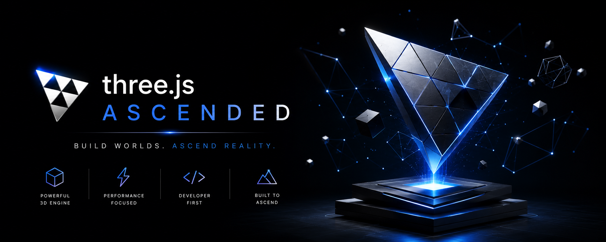

<p align="center">
  
</p>

# three.js Ascended

<p align="center">
  <a href="https://github.com/mrigankad/threejs-ascended/actions/workflows/ascended-ci.yml"></a>
  
  
  
</p>

**Build worlds. Ascend reality.** A personal, batteries-included build on top of [three.js](https://github.com/mrdoob/three.js).

three.js Ascended is the full three.js library plus a small **[`ascended` helper layer](./addons/ascended/)**
that removes the most common friction points — scene setup boilerplate and the
"nothing shows up because there's no light" trap — so you can go from zero to a
rendered, animated scene in a few lines.

```js
import { SceneApp, addStudioLighting } from 'threejs-ascended/addons/ascended';
import { BoxGeometry, Mesh, MeshStandardMaterial } from 'threejs-ascended';

const app = new SceneApp( { container: document.querySelector( '#app' ) } );
addStudioLighting( app.scene );

const cube = new Mesh( new BoxGeometry(), new MeshStandardMaterial( { color: 0x3399ff } ) );
app.scene.add( cube );

app.onUpdate( ( delta ) => { cube.rotation.y += delta; } );
app.start();
```

→ See the **[Ascended helper docs](./addons/ascended/)** and the runnable
[`example.html`](./addons/ascended/example.html) demo.

> **Attribution.** This is a personal fork based on three.js r184. All credit for
> the underlying library goes to [mrdoob](https://github.com/mrdoob) and the
> three.js contributors. Distributed under the original three.js MIT License
> (see [`LICENSE`](./LICENSE)). This fork is **not** affiliated with or endorsed
> by the upstream three.js project. For the official, actively maintained
> library, use [three.js](https://github.com/mrdoob/three.js).

---

# three.js

[![NPM Package][npm]][npm-url]
[![Build Size][build-size]][build-size-url]
[![NPM Downloads][npm-downloads]][npmtrends-url]
[![jsDelivr Downloads][jsdelivr-downloads]][jsdelivr-url]
[![Discord][discord]][discord-url]

#### JavaScript 3D library

The aim of the project is to create an easy-to-use, lightweight, cross-browser, general-purpose 3D library. The current builds only include WebGL and WebGPU renderers but SVG and CSS3D renderers are also available as addons.

[Examples](https://threejs.org/examples/) &mdash;
[Docs](https://threejs.org/docs/) &mdash;
[Manual](https://threejs.org/manual/) &mdash;
[Wiki](https://github.com/mrdoob/three.js/wiki) &mdash;
[Migrating](https://github.com/mrdoob/three.js/wiki/Migration-Guide) &mdash;
[Questions](https://stackoverflow.com/questions/tagged/three.js) &mdash;
[Forum](https://discourse.threejs.org/) &mdash;
[Discord](https://discord.gg/56GBJwAnUS)

### Usage

This code creates a scene, a camera, and a geometric cube, and it adds the cube to the scene. It then creates a `WebGL` renderer for the scene and camera, and it adds that viewport to the `document.body` element. Finally, it animates the cube within the scene for the camera.

```javascript
import * as THREE from 'three';

const width = window.innerWidth, height = window.innerHeight;

// init

const camera = new THREE.PerspectiveCamera( 70, width / height, 0.01, 10 );
camera.position.z = 1;

const scene = new THREE.Scene();

const geometry = new THREE.BoxGeometry( 0.2, 0.2, 0.2 );
const material = new THREE.MeshNormalMaterial();

const mesh = new THREE.Mesh( geometry, material );
scene.add( mesh );

const renderer = new THREE.WebGLRenderer( { antialias: true } );
renderer.setSize( width, height );
renderer.setAnimationLoop( animate );
document.body.appendChild( renderer.domElement );

// animation

function animate( time ) {

	mesh.rotation.x = time / 2000;
	mesh.rotation.y = time / 1000;

	renderer.render( scene, camera );

}
```

If everything goes well, you should see [this](https://jsfiddle.net/w43x5Lgh/).

### Cloning this repository

Cloning the repo with all its history results in a ~2 GB download. If you don't need the whole history you can use the `depth` parameter to significantly reduce download size.

```sh
git clone --depth=1 https://github.com/mrdoob/three.js.git
```

### Change log

[Releases](https://github.com/mrdoob/three.js/releases)


[npm]: https://img.shields.io/npm/v/three
[npm-url]: https://www.npmjs.com/package/three
[build-size]: https://badgen.net/bundlephobia/minzip/three
[build-size-url]: https://bundlephobia.com/result?p=three
[npm-downloads]: https://img.shields.io/npm/dw/three
[npmtrends-url]: https://www.npmtrends.com/three
[jsdelivr-downloads]: https://data.jsdelivr.com/v1/package/npm/three/badge?style=rounded
[jsdelivr-url]: https://www.jsdelivr.com/package/npm/three
[discord]: https://img.shields.io/discord/685241246557667386
[discord-url]: https://discord.gg/56GBJwAnUS
